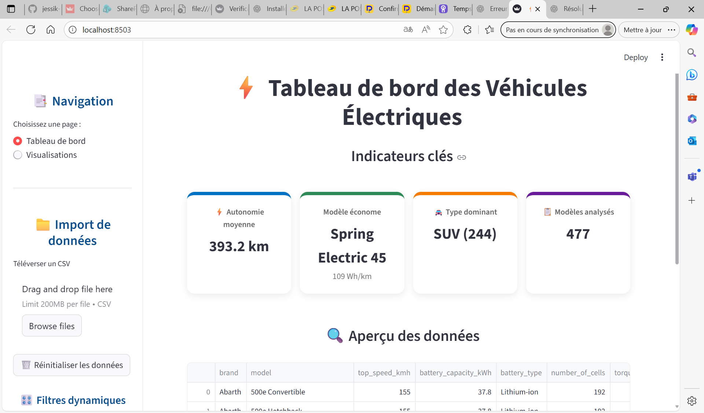

# MBAESG_EVALUATION_MANAGEMENT_OPERATIONNEL

# ⚡ Dashboard Véhicules Électriques
Ce projet présente une application interactive développée avec **Python** et **Streamlit**, connectée à une base de données DuckDB contenant des informations sur plus de 470 modèles de véhicules électriques.  
L'objectif est de permettre une **analyse rapide et visuelle** de leurs caractéristiques (autonomie, type de carrosserie, nombre de modèles, etc.).
---
## 🚗 Objectifs de l'application
- Visualiser les **indicateurs clés** sur les modèles de véhicules électriques :
 - Autonomie moyenne
 - Modèle le plus économe
 - Type dominant (SUV, Berline, etc.)
 - Nombre total de modèles analysés
- Afficher un **aperçu interactif** des données importées (upload CSV)
- Proposer une section de **visualisations dynamiques** :
 - Autonomie par marque
 - Répartition des types de carrosserie
 - Distribution des batteries
- Donner la possibilité à l’utilisateur de **téléverser ses propres fichiers** `.csv`
---
## ⚙️ Fonctionnalités
| Fonction | Description |
|----------|-------------|
| **Sidebar** | Choix de la page, import de fichier, filtrage dynamique |
| **KPI Cards** | Affichage de 4 indicateurs clés dès l'accueil |
| **Tableau interactif** | Aperçu des données importées, tri & scroll |
| **Graphiques Plotly** | Visualisations : histogrammes, bar charts, scatter... |
| **Architecture modulaire** | Code structuré avec une logique claire (chargement, traitement, affichage) |
---
## 🛠️ Technologies utilisées
- **Python** 🐍
- **Streamlit** – Interface web interactive
- **DuckDB** – Base de données légère embarquée
- **Pandas** – Manipulation de données
- **Plotly Express** – Graphiques interactifs et dynamiques
- **Streamlit Sidebar** – Navigation multi-pages
- **Git & GitHub** – Versioning & hébergement du code
---
## 📁 Fichiers principaux
| Fichier | Rôle |
|--------|------|
| `appli.py` | Code principal de l'application |
| `vehicules_electriques.duckdb` | Base de données locale contenant les données (non pushée) |
| `.gitignore` | Exclut les fichiers lourds / sensibles du repo |
| `README.md` | Présentation du projet |
---
## 📝 À propos du dataset
Le fichier DuckDB utilisé contient des informations sur :
- La marque, le modèle, et l'année
- Le type de carrosserie
- La capacité de la batterie (kWh)
- L’autonomie estimée (km)
- Le type de batterie (Lithium-ion, etc.)
- Le nombre de cellules
- Le poids, la vitesse max et d’autres specs
---
## 🔒 Remarques
- Le fichier `.duckdb` n'est **pas inclus dans le dépôt** pour des raisons de poids.  
> Il est automatiquement ignoré via `.gitignore` ✅  
- L’application fonctionne **localement**, aucun hébergement cloud n’est requis.
---
## 📷 Aperçu visuel

---
## 👩🏽‍💻 Réalisé par
**Ange Muriel Kamguem Mande**  
_Master 2 Big Data & Intelligence Artificielle_  
_Projet académique & personnel – Octobre 2025_

🌐 [Portfolio](jessik-19.github.io/portfolio_kamguem/)  
🔗 [LinkedIn](linkedin.com/in/ange-muriel-kamguem-mande-aabaa7295)
---
